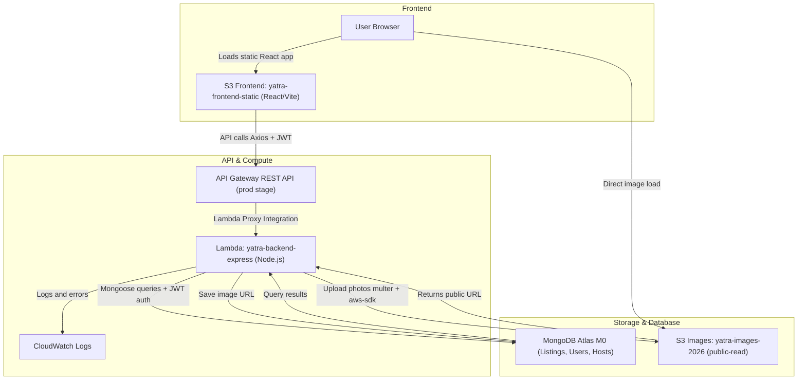

# Yatra

Cloud-ready refactor with clean app separation.


## Architecture Diagram



## Folder Structure

```text
Yatra./
  backend/        # Stateless Express API (JWT, MongoDB)
  frontend/       # React + Vite client
  infrastructure/ # Serverless Framework deployment config
  CLOUD_READY_REFACTOR.md
  README.md
```

## Run Backend (API)

```bash
cd backend
npm install
npm run dev
```

API base: `http://localhost:4000/api/v1`

## Run Frontend (React)

```bash
cd frontend
npm install
npm run dev
```

Frontend dev URL: `http://localhost:5173`

## Environment Files

- Backend: `backend/.env`
- Frontend: `frontend/.env`

Use each folder's `.env.example` as template.

## Deployment

Serverless deployment lives in `infrastructure/serverless.yml` and targets the Lambda handler at `backend/handler.js`.
