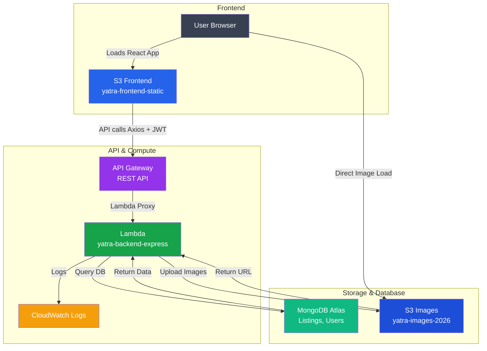

# Yatra

Cloud-ready refactor with clean app separation.

## Architecture Diagram

```mermaid
flowchart TB

subgraph Frontend
    User["User Browser"]
    S3Frontend["S3 Frontend<br/>yatra-frontend-static"]
end

subgraph "API & Compute"
    APIGateway["API Gateway<br/>REST API"]
    Lambda["Lambda<br/>yatra-backend-express"]
    CloudWatch["CloudWatch Logs"]
end

subgraph "Storage & Database"
    MongoDB["MongoDB Atlas<br/>Listings, Users"]
    S3Images["S3 Images<br/>yatra-images-2026"]
end

User -->|Loads React App| S3Frontend
S3Frontend -->|API calls Axios + JWT| APIGateway
APIGateway -->|Lambda Proxy| Lambda

Lambda -->|Logs| CloudWatch

Lambda -->|Query DB| MongoDB
MongoDB -->|Return Data| Lambda

Lambda -->|Upload Images| S3Images
S3Images -->|Return URL| Lambda

User -->|Direct Image Load| S3Images

%% Colors

style User fill:#374151,color:#fff
style S3Frontend fill:#2563eb,color:#fff
style APIGateway fill:#9333ea,color:#fff
style Lambda fill:#16a34a,color:#fff
style CloudWatch fill:#f59e0b,color:#fff
style MongoDB fill:#10b981,color:#fff
style S3Images fill:#1d4ed8,color:#fff
```

